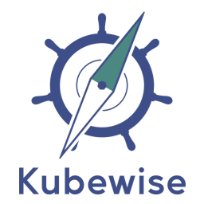

# Kubewise's Kubernetes agent

This repository contains [Helm](https://helm.sh) charts to deploy the [Kubewise K8s agent](https://doc.kubewise.io/k8s-agent/).

The **K8s agent** is a Kubewise application specificaly designed for Kubernetes clusters, to collect information from applications running within the cluster. It listens to [Kubernetes events](https://kubernetes.io/docs/reference/kubernetes-api/cluster-resources/event-v1/) to retrieve and compute events that will later be analyzed by Kubewise.

Please refer to the [documentation](https://doc.kubewise.io/k8s-agent/installation/) for more information on how to install the agent.